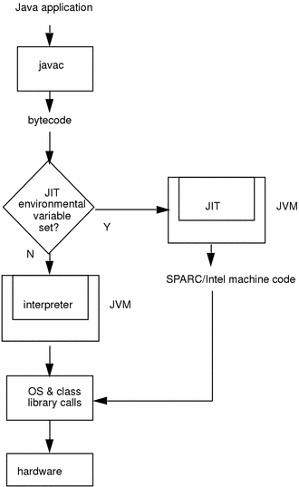
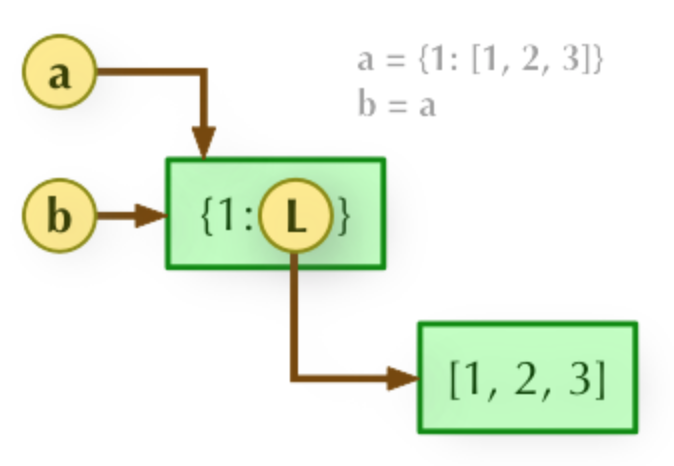
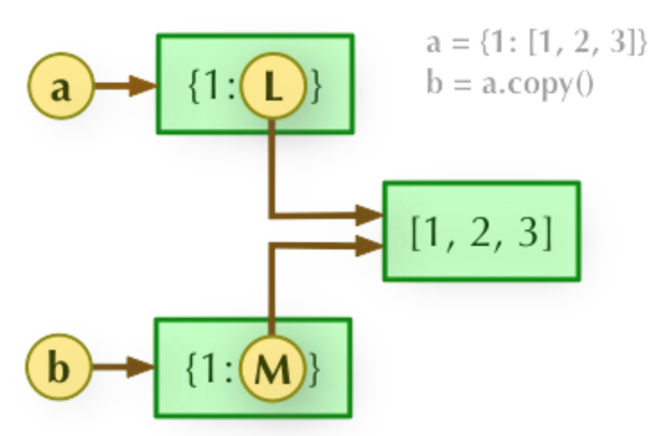
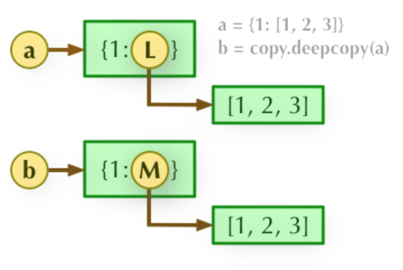

# 第一章 Python简介

### 解释型？编译型？



Python Java并不是严格意义上的解释型语言，shell是

先编译成字节码，再由解释器执行，若有JIT优化，会将字节码编译成机器码

```shell
python -m py_compile file.py	# generate pyc
python -O py_compile file.py 	# generate pro
```

### Python解释器

摘自文档：Calling `help(thing)` prints help for the python object 'thing'.

```python
>>> 8 / 5				# division always returns a floating point number
1.6
>>> 8 // 5			# divide exactly
1
>>> 2 ** 5			# power
32
>>> 1.445 + _		# _ for last result
33.445
>>> round(_, 2)	# round
33.45
```

### 注释

```python
# a single line comment

'''
	this 
	is
	a
	multi-line
	comment
'''
```

### 多行语句和多条语句

```python
num1 = 1 + \
			2 + \
			3				# multi-line exp
num2 = num1; num1 += 1;		# from left to right
```

# 第二章 标准数据类型

数字、字符串、元组属于不可变类型

列表、字典、集合属于可变类型

判断变量类型一般用`type(object)`

`isinstance(object, class_or_tuple)`也可，但认为子类是一种父类的类型

### Number

##### int

为什么不支持++运算？

```python
>>> num = 1
>>> id(num)			# return the identity of an object
4447334160
>>> num += 1
>>> id(num)
4447334192
```

##### bool

True/False

##### float

```python
>>> type(1.0)
<class 'float'>
```

##### complex

```python
>>> type(1+2j)
<class 'complex'>
```

### String

单引号与双引号使用完全相同

```python
str1 = '''multi-line
string'''
str2 = r'abc\n'				# same as 'abc\\n'
str3 = 'abc'" def"
str4 = 'ab' + '3'
str5 = 'ab' * 3
```

##### 切片

```python
'''
	str[begin_index: end_index: step]
	step 正表示从左到右，负表示从右到左，默认为1
	begin_index 包含自身索引，step为正时默认为0，step为负时默认为len(str)
	end_index 不包含自身索引，step为正时默认为len(str)，step为负时默认为0-1
'''
str = '012345'
str[:]
str[::]
str[:4:]
str[::-1]		# reverse
str[:4:-1]
str[4::-1]
str[4::-1][:3]
str[-1:-3:-1]
str[-1:0]
str[2:4] = 'ab'		# 'str' object does not support item assignment
```

元组，列表，字符串都可以进行切片操作

### 可变类型？不可变类型？

##### id(object)函数

返回object的唯一标识，在用c实现的解释器中返回变量内存

##### is运算符

`==`用于判断值是否相等，`is`用于判断id是否相等

```python
>>> a = 2.0
>>> b = 2.0
>>> id(a); id(b)
4304061360
4303158512
>>> a == b; a is b
True
False
```

但对于数值较小的int和string，CPython会重用对象内存

```python
>>> c = 2
>>> d = 2
>>> id(c); id(d)
4298071856
4298071856
>>> c == d; c is d
True
True
```

##### 不可变类型赋值

```python
>>> str = '12'
>>> id(str)
4451839664
>>> str = '123'
>>> id(str)
4451792560
```

不可变类型赋值的实质是重新分配内存再改变引用

```python
>>> str1 = 'ab'
>>> str2 = str1
>>> id(str1); id(str2)
4301983664
4301983664
```

str1与str2引用同一块内存，故id相同

```python
>>> str1 = 'abc'
>>> id(str1); id(str2)
4299996272
4301983664
```

对str1重新赋值后str2的引用不变

由于元组中可以有可变类型，相对复杂，留到浅拷贝和深拷贝那块再讲

### Tuple

```python
empty = ()							# empty tuple
t1 = ('ab'); type(t1)		# parenthesis not only means tuple
t2 = ('ab',); type(t2)

len(t1)
t3 = ('12', 'ab', 2)
2 in t3
a, b, c = t3						# unpack
```

### List

```python
empty = []							# empty list
l1 = [1]; l2 = [1,]			# no ambiguity
l1[:2] = []

l1.append(2)						#	Append object to the end of the list.
l1.append([3, 4])

l1.extend([3, 4])				# extend(iterable)
l1.extend([3, [4, 5]])	# Extend list by appending elements from the iterable.
l1.extend(3)						# TypeError: 'int' object is not iterable

l1.insert(0, 4)					# insert(index, object)

l1.remove([3, 4])				# remove(value) Remove first occurrence of value.

l1.pop()								# pop(index=-1)
l1.pop(0)								# Remove and return item at index

l1.index(3)							# index(value, start=0, stop=9223372036854775807) 
l1.index(3, 3)					# Return first index of value.

l1.count(3)							# count(value) Return number of occurrences of value.

# sort(cmp=None, key=None, reverse=False)
l1.sort(key=lambda x:x[0] if '__iter__' in dir(x) else x)

l1.reverse()

l1.copy()								# return a shallow copy, same as l1[:]

l1.clear()
```

列表可当做栈使用

### Set

不重复集合组成的无序集，用于成员检测和消除重复

```python
empty = set()					# empty set
str = set('sdbdsfsb')

s1 = {'a', 'b'}
s2 = {'b', 'd'}
s1.add('c')
s2.update([1, 4], [2, 4])
s2.remove(4)
s2.discard(3)					# remove throws exception when value isn't in the set, discard won't

s1 & s2
s1 | s2
s1 ^ s2
```

### Dictionary

列表、元组以整数为索引，字典以关键字为索引，关键字可以是任意不可变类型（数字、字符串、只包含数字字符串和元组的元组），可以看出一个键值对的集合

```python
empty = {}				# not empty set but empty dictionary

dict = {'a': 12, 'b': 43}
dict['c'] = 23
dict['c'] = 32
dict.items()
dict.keys()
dict.values()
```

### for遍历

```python
list = [x**2 for x in range(10)]		# 列表推导式
set = {x for x in range(10)}				# 集合推导式
dict = {x: x**2 for x in (2, 4, 6)}	# 字典推导式
g = (x for x in range(10))					# generator

[x*2 for x in list]
[(x, y) for x in [1,2,3] for y in [3,1,4] if x != y]


for item in list:
  print(item)

for key, value in dict.items():
  print(dict[key])

for i, value in enumerate(list):
  print(i, value)

for v1, v2 in zip(list1, list2):
  print(v1, v2)
```

### 赋值、浅拷贝、深拷贝

##### 赋值

```python
>>> a = [1, 3, 5]
>>> b = a
>>> b[1] = 2
```

赋值类似于`Type &b = a`，a和b指向同一对象



对于严格的不可变类型(数字、字符串和无可变类型元素的元组)，对b的操作将重新开辟内存，不会改变a

对于可变类型和带有可变类型的tuple，对b的操作仍在原来的地址进行，会改变a

```python
>>> a = (1, [2, 3])
>>> b = a
>>> b[1][0] = 1
>>> a
(1, [1, 3])
```

##### 浅拷贝

对于不可变类型，浅拷贝与赋值等效，指向同一对象

对可变类型变量a的浅拷贝包括

* a[:]
* a.copy()
* copy.copy(a)

对可变类型来说，a和b独立，但a和b的子对象仍指向同一对象



```python
>>> a = [1, (2, 3)]
>>> b = a[:]
>>> a is b
False
>>> a[1] is b[1]
True
```

##### 深拷贝

对于严格的不可变类型(数字、字符串和无可变类型元素的元组)，深拷贝与赋值等效

对于可变类型和带有可变类型的tuple，深拷贝将完全拷贝父对象及所有子对象，a和b完全独立



```python
import copy
a = [1, 2, 3, 4, ['a', 'b']]
 
b = a
c = copy.copy(a)
d = copy.deepcopy(a)
 
a.append(5)
a[4].append('c')
 
print( 'a = ', a )
print( 'b = ', b )
print( 'c = ', c )
print( 'd = ', d )
```

### 扩展：C++的浅拷贝与深拷贝

何时调用拷贝构造函数？

1. 对象以值传递方式传入函数参数
2. 对象以值传递方式从函数返回
3. 对象通过另一个对象初始化(而不是赋值)

当类中没有定义任何构造函数时，编译器会默认提供一个无参构造函数且其函数体为空

如果没有自定义拷贝构造函数，编译器会提供一个默认的拷贝构造函数，对于基本类型的成员变量，按字节复制，对于类类型成员变量，调用其相应类型的拷贝构造函数。

默认构造函数是浅拷贝

# 第三章 过程控制

### if

```python
if exp1:
  	pass
    if exp2:
        pass
    elif exp3:
        pass
    else:
        pass
elif exp4:
    pass
else:
    pass
```

类似于三目运算符的用法`exp1 if cond else exp2`

### while

```python
count = 0
while count < 5:
   print (count, " 小于 5")
   count += 1
else:
   print (count, " 大于或等于 5")
```

### break&continue

```python
n = 5
while n > 0:
    n -= 1
    if n == 2:
        continue
    print(n)
```

与C/C++类似

### pass

# 第四章 函数

### 函数定义

```python
def func():
		print("hello world")
```

### 参数类型

```python
def enroll(name, gender, /, age=6, city='Beijing', *, grade):
  	# name和gender为必需参数，要在默认参数之前，出现在星号*后的参数必须用关键字传入
    # 3.8新增特性，/前的为位置参数，不可用关键字参数指定
    print('name:', name)
    print('gender:', gender)
    print('age:', age)
    print('city:', city)

enroll('Bob', 'M', 7, grade=99)
enroll('Adam', 'M', grade=89, city='Tianjin')								# 调用时可以使用以关键字传参
```

##### 不定长参数

加了星号 $*$ 的参数会以元组的形式导入，存放所有未命名的变量参数

```python
def printinfo(arg1, *vartuple ):
   print(arg1)
   print(vartuple)

printinfo(70, 60, 50)
args = (1, 2, 3)
printinfo(*args)				# same as printinfo(1, 2, 3)
```

加了两个星号$**$的参数会以字典的形式导入

```python
def printinfo(arg1, **vardict):
   print(arg1)
   print(vardict)

printinfo(1, a=2, b=3)
dict = {'arg1':1, 'a':1, 'b':2, 'c':3}
printinfo(**dict)			# same as printinfo(arg1=1, a=1, b=2, c=3)
```

### 参数传递

Python中类型属于对象，变量是没有类型的，所有变量都可以看成对内存中对象的引用

据此，所有参数传递都可以看成引用传递，无论参数的数据类型是否可变

##### 不可变类型

```python
def change(a):
    print(id(a))
    a=10
    print(id(a))
 
a=1
print(id(a))
change(a)
print(id(a))
```

##### 可变类型

```python
def changeme(mylist):
   mylist.append([1,2,3,4])
   print(mylist)
   return

mylist = [10,20,30]
changeme(mylist)
print(mylist)
```

### Lamba函数

# 第五章 输入输出

# 第六章 错误与异常

# 第七章 面向对象

迭代器与生成器

装饰器

# 第八章 标准库简介

