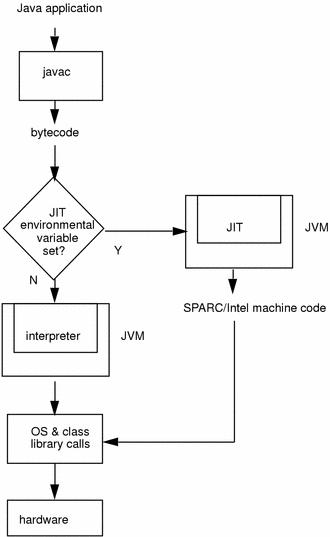

# 第一章 Python简介

### 解释型？编译型？



```shell
python -m py_compile file.py	# generate pyc
python -O py_compile file.py 	# generate pro
```

### Python解释器

摘自文档：Calling `help(thing)` prints help for the python object 'thing'.

```python
>>> 8 / 5				# division always returns a floating point number
1.6
>>> 8 // 5			# divide exactly
1
>>> 2 ** 5			# power
32
>>> 1.445 + _		# _ for last result
33.445
>>> round(_, 2)	# round
33.45
```

### 注释

```python
# a single line comment

'''
	this 
	is
	a
	multi-line
	comment
'''
```

### 多行语句和多条语句

```python
num1 = 1 + \
			2 + \
			3				# multi-line exp
num2 = num1; num1 += 1;		# from left to right
```

# 第二章 标准数据类型

数字、字符串、元组属于不可变类型

列表、字典、集合属于可变类型

判断变量类型一般用`type(object)`

`isinstance(object, class_or_tuple)`也可，但认为子类是一种父类的类型

### Number

##### int

为什么不支持++运算？

```python
>>> num = 1
>>> id(num)			# return the identity of an object
4447334160
>>> num += 1
>>> id(num)
4447334192
```

##### bool

True/False

##### float

```python
>>> type(1.0)
<class 'float'>
```

##### complex

```python
>>> type(1+2j)
<class 'complex'>
```

### String

单引号与双引号使用完全相同

```python
str1 = '''multi-line
string'''
str2 = r'abc\n'				# same as 'abc\\n'
str3 = 'abc'" def"
str4 = 'ab' + '3'
str5 = 'ab' * 3
```

##### 切片

```python
'''
	str[begin_index: end_index: step]
	step 正表示从左到右，负表示从右到左，默认为1
	begin_index 包含自身索引，step为正时默认为0，step为负时默认为len(str)
	end_index 不包含自身索引，step为正时默认为len(str)，step为负时默认为0-1
'''
str = '012345'
str[:]
str[::]
str[:4:]
str[::-1]		# reverse
str[:4:-1]
str[4::-1]
str[4::-1][:3]
str[-1:-3:-1]
str[-1:0]
str[2:4] = 'ab'		# 'str' object does not support item assignment
```

元组，列表，字符串都可以进行切片操作

### 可变？不可变？

##### id(object)函数

返回object的唯一标识，在用c实现的解释器中返回变量内存

##### is运算符

`==`用于判断值是否相等，`is`用于判断id是否相等

```python
>>> a = 2.0
>>> b = 2.0
>>> id(a); id(b)
4304061360
4303158512
>>> a == b; a is b
True
False
```

但对于数值较小的int和string，CPython会重用对象内存

```python
>>> c = 2
>>> d = 2
>>> id(c); id(d)
4298071856
4298071856
>>> c == d; c is d
True
True
```

##### 不可变类型赋值

```python
>>> str = '12'
>>> id(str)
4451839664
>>> str = '123'
>>> id(str)
4451792560
```

不可变类型赋值的实质是重新分配内存再改变引用

```python
>>> str1 = 'ab'
>>> str2 = str1
>>> id(str1); id(str2)
4301983664
4301983664
```

str1与str2引用同一块内存，故id相同

```python
>>> str1 = 'abc'
>>> id(str1); id(str2)
4299996272
4301983664
```

对str1重新赋值后str2的引用不变

由于元组中可以有可变类型，相对复杂，留到浅拷贝和深拷贝那块再讲

### Tuple

### List

### Dictionary

### Set

### 浅拷贝？深拷贝？

# 第三章 过程控制

### if

### for

### while

### break&continue

### pass

# 第四章 函数

# 第五章 输入输出

# 第六章 错误与异常

# 第七章 面向对象

# 第八章 标准库简介

